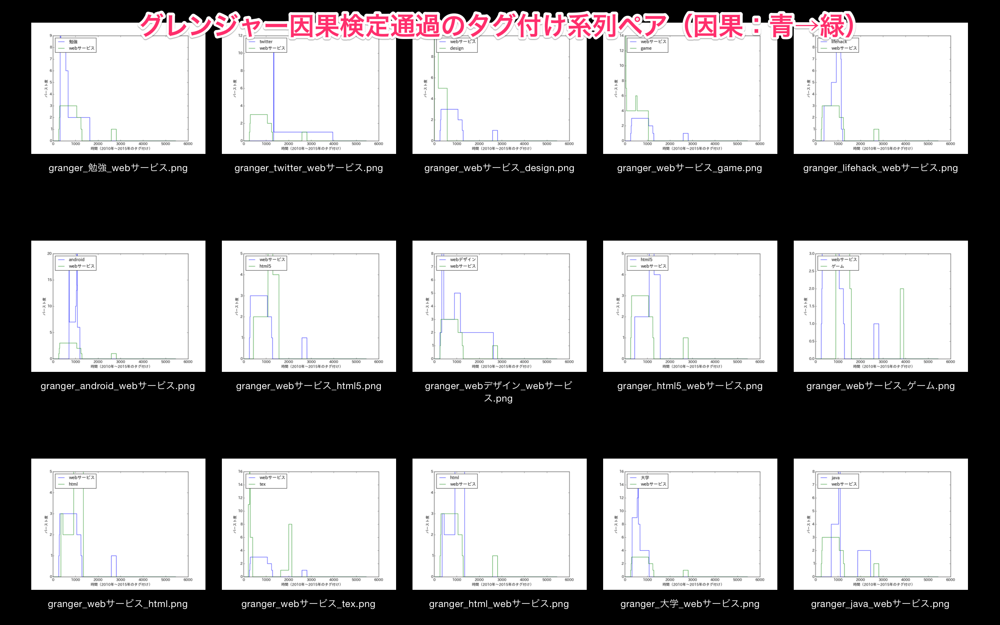
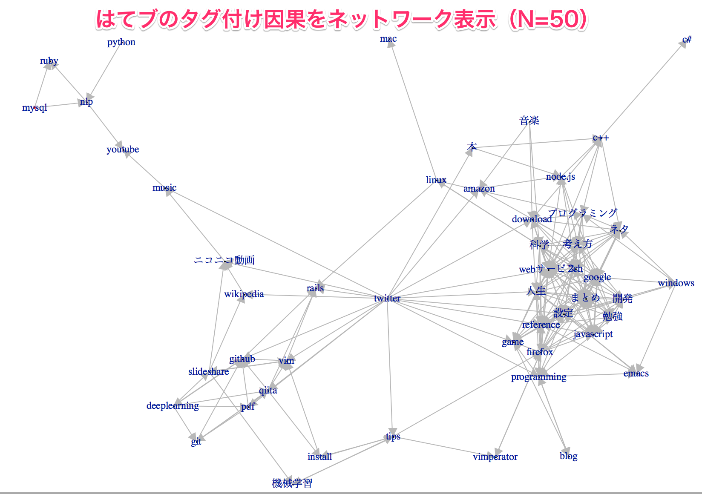
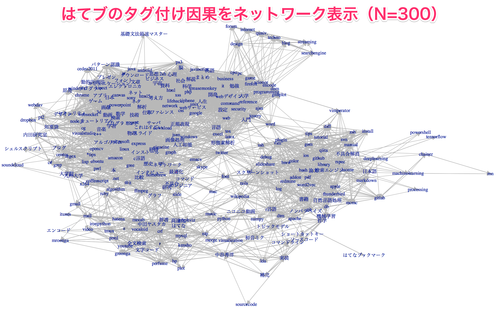

# AnalyseHatenaBookmarkTagSeries

はてなブックマークしたWebページおよびそれにつけたタグを入力とし、タグ付けの傾向を分析します。  




## はてなブックマークからの情報取得
1. はてなブックマーク情報取得スクリプトの実行  

    ```shellscript
    python get_tags.py [はてなブックマークID] -D inverted_url_list.csv
    ```
    [注]  
     * 「マイブックマーク」は「公開する」に設定にする必要があります。設定ページは[こちら](http://b.hatena.ne.jp/-/my/config/profile)  
     * 細かい設定はコマンドライン引数で渡すことができます。  
        ```
        python get_tags.py -h
        ```


## タグ付け系列に対する因果取得
1. タグ付けのバースト系列取得 ＆ バースト系列に対するグレンジャー因果検定スクリプト実行

    ```shellscript
    python detect_causality.py invert_url_list.csv -o ./granger_causality.csv
    ```
    [備考] スクリプトのconfig値は、下記の通りです。
    * 細かい設定はコマンドライン引数で渡すことができます。  
       ```
       python detect_causality.py -h
       ```

## 因果ネットワークの表示
1. Rの実行

    ```shellscript
    R
    ```
2. 因果ネットワークの描画

    ```Rscript
    library(igraph)
    csvdata <- read.csv("./granger_causality.csv", head = T)
    graphdata <- graph.data.frame(csvdata, directed = T)
    tkplot(
      graphdata,
      vertex.label=V(graphdata)$name,
      canvas.width = 1200,
      canvas.height = 700,
      vertex.size = 0,
      edge.width=E(graphdata)$p_value)
    ```

## 付録：偏グレンジャー因果の算出
上では、グレンジャー因果を用いて因果ネットワークを作成しましたが、グレンジャー因果には第三者変数による影響を受けてしまうという考え/問題があります。この問題を解消する方法に、偏相関の考えを応用した偏グレンジャー因果という手法があります。ここでは、その偏グレンジャー因果検定の算出方法を記します。

1. Rの実行

    ```shellscript
    R
    ```
2. 偏グレンジャー因果検定

    ```Rscript
    library(Matrix)
    library(np)
    library(devtools)
    source_url('https://raw.githubusercontent.com/cran/FIAR/master/R/partGranger.R')
    source_url('https://raw.githubusercontent.com/cran/FIAR/master/R/partGranger3.R')

    csvdata <- read.csv("./burst_series.csv", head = F, stringsAsFactors=F)
    trans_csvdata <- tail(t(csvdata), n=-1)
    trans_csvdata_numeric <- apply(trans_csvdata, c(1,2), as.numeric)
    partGranger3(trans_csvdata_numeric, nx=1, ny=1, order=1, bs=10)
    ```

## 参考ページ
* [1] [イベントの時系列分析による因果関係知識の獲得](https://www.jstage.jst.go.jp/article/tjsai/30/1/30_30_12/_pdf)
* [2] [Kleinberg のバースト検知 (列挙型) について](http://cl-www.msi.co.jp/reports/kleinberg-enumerate.html)
* [3] [pybursts 0.1.1](https://pypi.python.org/pypi/pybursts/0.1.1)
* [4] [はてなブックマークエントリー情報取得API](http://developer.hatena.ne.jp/ja/documents/bookmark/apis/getinfo)
* [5] [Granger因果による時系列データの因果推定（因果フェス2015）](http://www.slideshare.net/takashijozaki1/granger2015)
* [6] [【 Python で 時系列分析 / 計量経済分析 】「Grangerの因果性テスト」で、時系列データ どうしの影響関係の方向 を 検定できる方法](http://qiita.com/HirofumiYashima/items/92588b661353b0e1aa5e)
* [7] [はてなブックマーク記事のレコメンドシステムを作成　PythonによるはてなAPIの活用とRによるモデルベースレコメンド](http://overlap.hatenablog.jp/entry/2013/06/30/232200)
